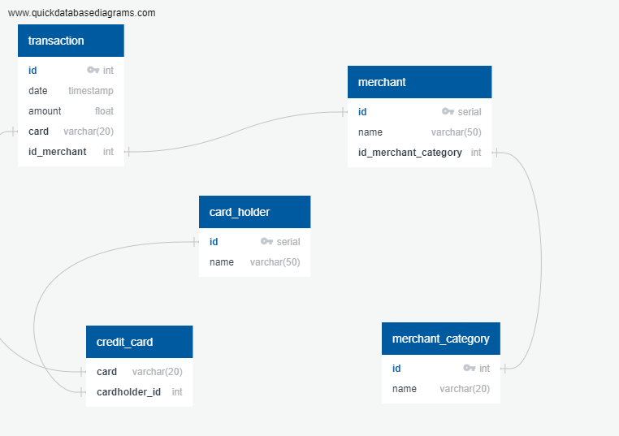

# Unit 7 Homework Assignment: Looking for Suspicious Transactions
## by Cheuk Man (Chapman) Mong

## Data Modeling
The entity relationship diagram (ERD) is shown below and can also be found in the "ERD_model.png" file and was created using Quick Database Diagrams.
The queries used can be found in [queries.sql](queries.sql)




The number of tables and the fields they contain were dictated by the provided CSVs and the relational design (foreign key relationships) were designed based on the simplest and most logical reasonings.

## Data Engineering
The schema used to create the database can be found in the [schema.sql](schema.sql) file based on the ERD model shown previously.
The data from the csv files were imported using pgadmin to create the database.

## Data Analysis Part 1
### Transactions less than $2 

##### How can you isolate (or group) the transactions of each cardholder?
##### Count the transactions that are less than $2.00 per cardholder.
##### Is there any evidence to suggest that a credit card has been hacked? Explain your rationale.

The following SQL query can be used to find all cards with transactions of $2 or less and ordered in descending order of the number of such transactions:

`SELECT card, count(*) FROM transaction WHERE amount < 2 GROUP BY card ORDER BY count(*) DESC LIMIT 10;`

The following cards are the top 10 "most suspicious" based on the number of small transactions and will be investigated further.

"376027549341849" , "584226564303", "344119623920892", "180098539019105", "3516952396080247", "4743204091443101526", "4962915017023706562", "3561954487988605", "503842928916", "4268491956169254"


The following SQL query was used to look closely at transactions made using the suspicious cards ordered by date to look for any abnormalities including but not limited to: large purchases, repeatitive transactions, abnormal frequency of transactions, suspicious patterns, etc.

`SELECT * FROM transaction where card = '376027549341849' ORDER BY date;`

After looking through all the data, it was found that the credit cards with the numbers 344119623920892 and 3516952396080247 each had suspicious tranasctions including abnormal amounts (1769.0000000000002 and 1685.0000000000002) and both had several large purchases of over $1000 while most transactions from other never went over two figures.

### Transactions during suspicous hours
##### What are the top 100 highest transactions made between 7:00 am and 9:00 am?
##### Do you see any anomalous transactions that could be fraudulent?
##### Is there a higher number of fraudulent transactions made during this time frame versus the rest of the day?
##### If you answered yes to the previous question, explain why you think there might be fraudulent transactions during this time frame.

The following SQL query looks for the top 100 highest transactions made between 7 and 9 am:

`SELECT * From transaction where extract(hour from date) BETWEEN 7 and 9 ORDER BY amount DESC LIMIT 100;`

The top two transactions were the same ones highlighted previously with the abnormal amounts, and are highly likely to be fraudulent.

It also seems highly unusual for so many large transactions to be made so early in the morning.

Assuming that these are fraudulent transactions then it makes sense that criminals would make these transactions before business hours so that the customers will not receive a call from the bank for confirmation and cancel the transaction.

##### What are the top 5 merchants prone to being hacked using small transactions?
The following SQL query was used to find the top 5 merchants with the most small transactions
`SELECT id_merchant, count(*) FROM transaction where amount < 2 GROUP BY id_merchant ORDER BY count(*) DESC LIMIT 5;`

##### View for small transactions:
```
CREATE VIEW small_transactions AS
SELECT card, count(*) 
FROM transaction 
WHERE amount < 2 
GROUP BY card 
ORDER BY count(*) 
DESC LIMIT 10;

SELECT * FROM small_transactions;
```

##### View for transactions during suspicious hours:
```
CREATE VIEW suspicious_hours AS
SELECT * FROM transaction 
WHERE extract(hour from date) 
BETWEEN 7 and 9 
ORDER BY amount 
DESC LIMIT 100;

SELECT * FROM suspicious_hours;
```


## Data Analysis Part 2
Refer to [Visual data notebook file](visual_data_analysis.ipynb) for the code.

##### What difference do you observe between the consumption patterns? Does the difference suggest a fraudulent transaction? Explain your rationale.

Cardholder 2 makes frequent small purchases (less than $20) and has never used it the buy anything over $20
Cardholder 18 spends in a similar way to Cardholder 2 in that he/she spends mostly on purchases under $20. The difference is in the large purchases made by Cardholder 18 where huge spikes can be seen on the graph indicating purchases that were magnitudes higher than the usual transaction.

##### Are there any outliers for cardholder ID 25? How many outliers are there per month?
Yes, according to the box plot, these are the number of outliers for each month:
Jan: 1
Feb: 0
Mar: 1
Apr: 3
May: 1
Jun: 3

##### Do you notice any anomalies? Describe your observations and conclusions.
It seems like there were a few out-lying almost monthly transactions over a $1000 which can be normal since there are recurring costs to running a business.
I doubt an expensive restaurant bill will cost over a thousand dollars.
However there were two three figure transactions in April that may link to the expensive restaurant bills. 


